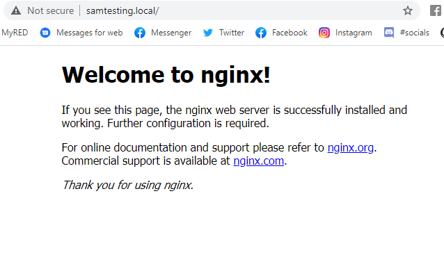

# First Virtual Box, Vagrant Dev Environment

This repo is our first Virtual Environment to create a Dev Environment

## Virtual Box


## Vagrant
Vagrant boxes - Pre leaded vagrant files that create virtual machines. Usually just an OS.

Ubunto is an open source OS
Ubuntu with GUI (Graphical user interface) - Looks like a desktop and works like one
Ubuntu headless - is basically a terminal, no GUI. (this is the one we will use).
  - Faster
  - More secure
  - Lighter

## Environments
Virtual environments are there to provide a simple solution to a whole host of problems. It is a tool for **dependency management** and **project isolation**. They allow site packages to be installed locally in an isolated directory for a particular project as opposed to being installed globally.
- Resolve dependancy issues
- Make your project self contained and reproducable
- install packages on a host on which you do not have admin priviledges
- Keep your global site packages directory tidy

### Main commands

- `vagrant init`
  - Makes vagrant file in repo
- `vagrant init <box>`
  - can search for boxes in https://app.vagrantup.com/<box> and it installs that box
- `vagrant up`
  - creates virtual environment
- `vagrant destroy`
  - destroys virtual environment
- `vagrant reload`
  - reloads environment for changes in vagrant file


##### Task 1
- Vagrant up with ubuntu/xenial64
- vagrant destroy
- delete your vagrant file
- use vagrant init to create vagrant file with centos 7
- vagrant up again
- vagrant destroy

**Take notes of machines being created in virtual box**

##### Task 2
- create a vagrant box with ubuntu version 18.04
- Find the command to SSH into the machine
- Create a README.md file inside machine and write your name and your favourite movie

###### Solution
- `vagrant init`
- change vagrant file to 
```
Vagrant.configure("2") do |config|
config.vm.box = "ubuntu/xenial64"
end
```
- `vagrant up`
- `vagrant ssh`


- linux commands to make readme `nano README.md`
- `exit`


### Next chapter
- add to vagrant file ``` config.vm.network "private_network", ip: "192.168.10.2" ```
- enter virt machine
- run some of these commands to install nginx
```
sudo apt update
sudo apt install nginx
```

- exit vagrant

- Now to get a normal link instead of ip address
- install plugin
```
vagrant plugin install vagrant-hostsupdater
```
- instuctions on this github link
https://github.com/agiledivider/vagrant-hostsupdater

- now can choose a hostname
```
config.vm.network "private_network", ip: "192.168.10.2"
config.vm.hostname = "www.samtesting.local"
```


- (quick not that http:// should be used as https:// stands for security which our local host wouldnt have set up)

